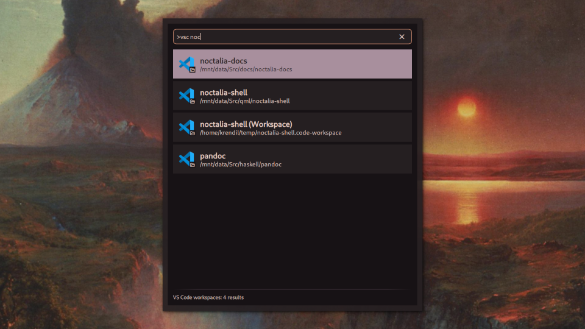

# VS Code Provider

A launcher provider plugin that lets you search your recently opened folders and workspaces in VS Code and its derivatives.

## Usage

1. Open the Noctalia launcher
2. Type `>vsc` to enter VSCode mode
3. Add a search term after the command (e.g., `>vsc noct`), or browse the most recently saved folders and workspaces
4. Select your workspaces and press Enter

Alternatively, you can trigger the provider by IPC with the command `qs -c noctalia-shell ipc call plugin:vscode-provider toggle`.

## Supported forks

This plugin can be configured to support different forks of VS Code, although only one fork can be used at a time.
The settings for this plugin includes preset configurations for Microsoft-distributed VS Code, as well as Code - OSS and Cursor.
Other forks can be configured by selecting the Other option, and entering the relevant details. See below for more information.

## Settings

### Include in main search

Whether to include VS Code workspaces in the main search results.

### VS Code fork

Which version or fork of VS Code to use. Select "Other" to enter your own details.

### Command

The command to launch this fork of VS Code.

### Config Name

The name of this fork's configuration directory in `~/.config`.

## Requirements

- Noctalia 4.5.0 or later
- VS Code, or one of its forks
